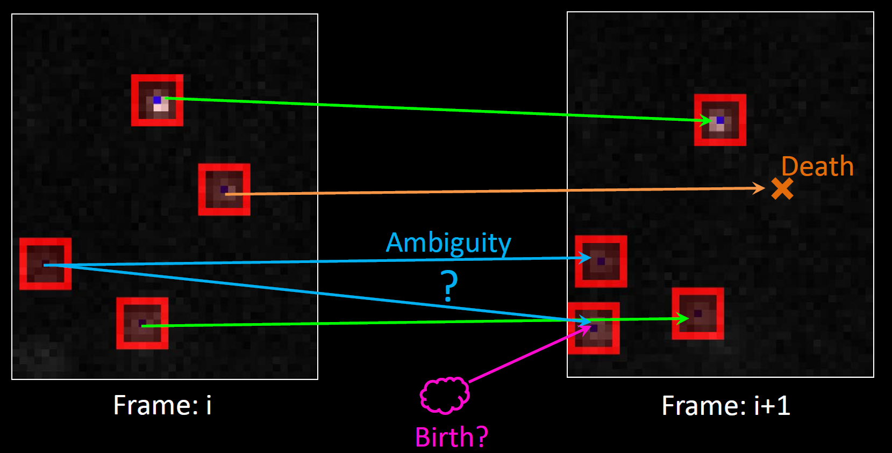

# Tracker
Particle tracking trajectory connector using a sparse LAP solver.

## Documentation
The Tracker Doxygen documentation can be build with the `OPT_DOC` CMake option and is also available on online:
  * [Tracker HTML Manual](https://markjolah.github.io/Tracker/index.html)
  * [Tracker PDF Manual](https://markjolah.github.io/Tracker/pdf/Tracker-0.1-reference.pdf)
  * [Tracker github repository](https://github.com/markjolah/Tracker)
